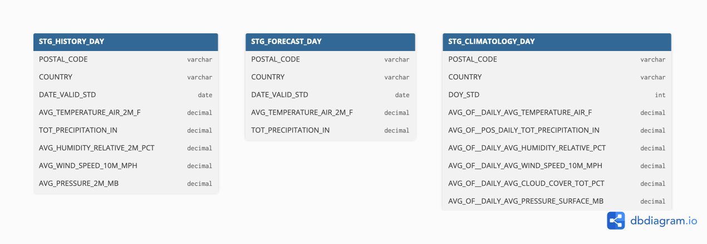
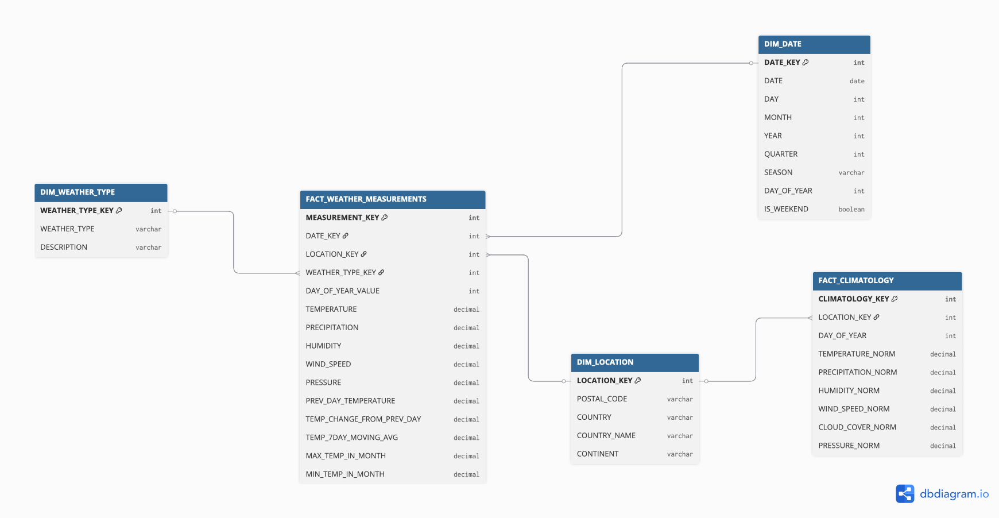
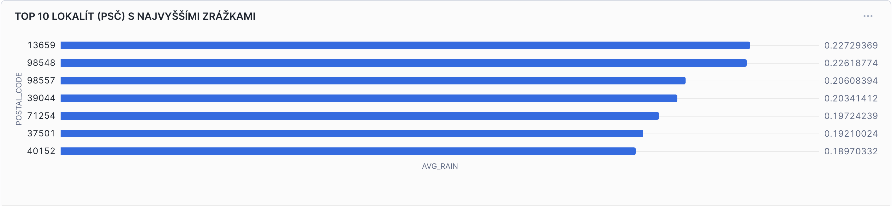
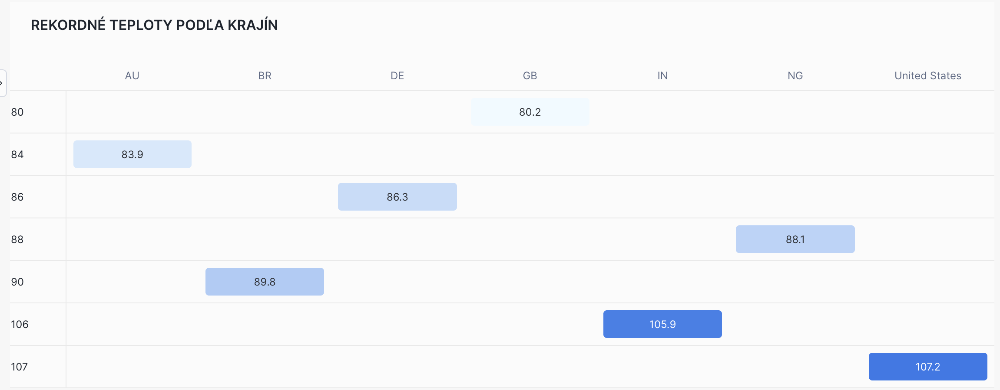
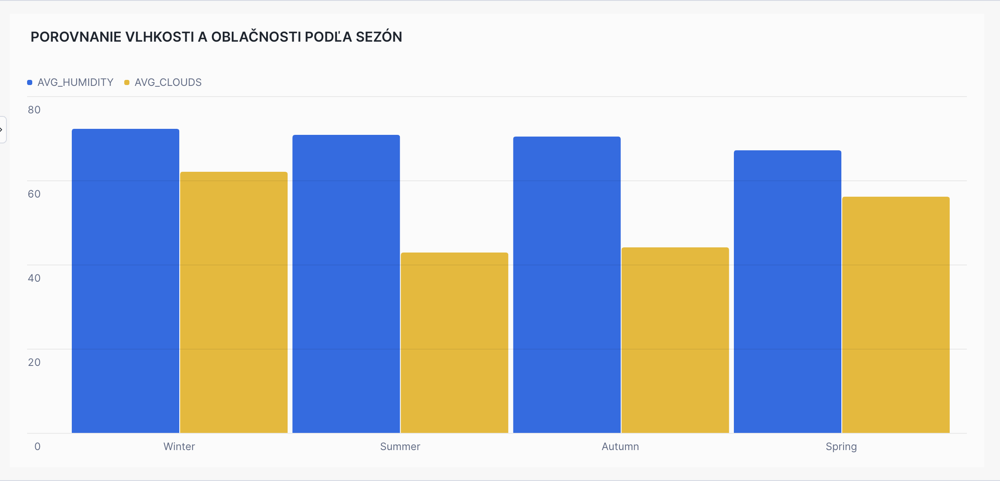
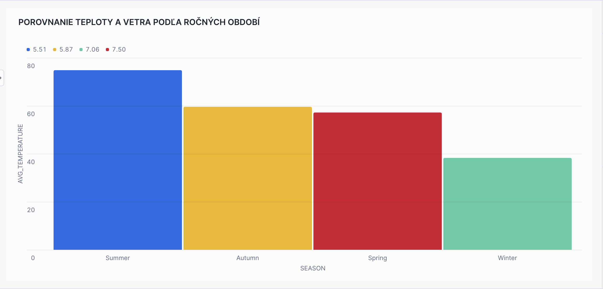
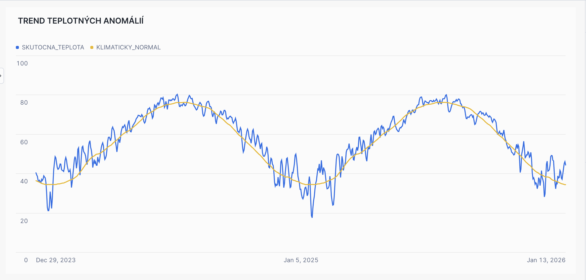
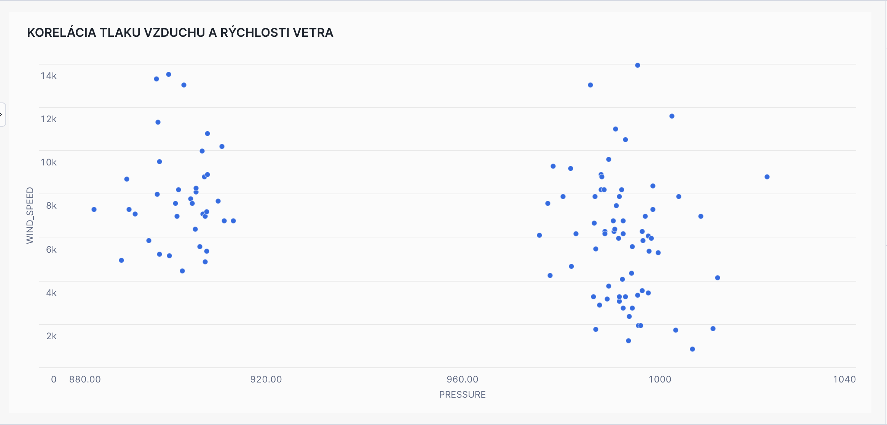

# **ELT proces datasetu Global Weather & Climate Data**

Tento repozitár predstavuje implementáciu ELT procesu v Snowflake a vytvorenie dátového skladu so schémou Galaxy Schema. Projekt pracuje s datasetom **Global Weather & Climate Data for BI** zo Snowflake Marketplace. Projekt sa zameriava na analýzu globálnych meteorologických podmienok, porovnanie historických meraní s predpoveďami a identifikáciu klimatických trendov. Výsledný dátový model umožňuje multidimenzionálnu analýzu a vizualizáciu kľúčových meteorologických metrik.

---

## **1. Úvod a popis zdrojových dát**

### **1.1 Výber datasetu**

Pre tento projekt som si vybral dataset **Global Weather & Climate Data for BI**, pretože moja bakalárska práca je zameraná na vytvorenie počasovej aplikácie. Tento záverečný projekt predmetu mi umožnil:
- **prakticky sa oboznámiť** s meteorologickými dátami a ich štruktúrou,
- **pochopiť proces predpovede** počasia a jeho presnosť,
- **analyzovať historické trendy** a klimatické normy,
- **pripraviť sa na prácu** s podobnými dátami v bakalárskej práci.

Práca s reálnymi meteorologickými dátami v prostredí Snowflake mi poskytla cenné skúsenosti s moderným cloud-based data warehousingom, ktoré môžem neskôr využiť.

### **1.2 Ciele projektu**

V tomto projekte analyzujeme globálne meteorologické dáta s cieľom porozumieť:
- klimatickým trendom a teplotným anomáliám,
- presnosti meteorologických predpovedí voči skutočným meraniam,
- extrémnnym poveternostným javom a ich geografickému rozloženiu,
- sezónnym vzorom v rôznych regiónoch sveta.

### **1.3 Zdrojové dáta**

Zdrojové dáta pochádzajú zo Snowflake Marketplace datasetu **Global Weather & Climate Data for BI**. Dataset obsahuje tri hlavné tabuľky:
- `HISTORY_DAY` - historické meteorologické merania (736,117 záznamov)
- `FORECAST_DAY` - meteorologické predpovede (17,110 záznamov)
- `CLIMATOLOGY_DAY` - dlhodobé klimatické normy (366,000 záznamov)

Účelom ELT procesu bolo tieto dáta pripraviť, transformovať a sprístupniť pre viacdimenzionálnu analýzu s použitím pokročilých analytických funkcií (Window Functions).

---

## **2. Dátová architektúra**

### **2.1 ERD diagram zdrojových dát**

Surové dáta sú organizované v troch nezávislých tabuľkách, ktoré nemajú explicitné Foreign Key väzby v zdrojovej databáze. Logické prepojenie existuje cez polia `POSTAL_CODE` a `COUNTRY`, čo umožňuje analýzu historických údajov, predpovedí a klimatických noriem pre tú istú lokalitu.

<p align="center">
  
  <br>
  <em>Obrázok 1: ERD diagram zdrojových dát z Snowflake Marketplace</em>
</p>

**Tabuľka HISTORY_DAY** obsahuje skutočné historické meteorologické merania vrátane teploty, zrážok, vlhkosti, rýchlosti vetra, oblačnosti a atmosférického tlaku.

**Tabuľka FORECAST_DAY** obsahuje predpovede počasia s rovnakou štruktúrou ako historické dáta, čo umožňuje priame porovnanie presnosti predpovedí.

**Tabuľka CLIMATOLOGY_DAY** obsahuje dlhodobé klimatické normy pre každý deň v roku (1-366), ktoré slúžia ako referenčné hodnoty na identifikáciu klimatických anomálií.

---

## **3. Dimenzionálny model**

V projekte bola navrhnutá **schéma galaxie (Galaxy Schema)** podľa Kimballovej metodológie. Na rozdiel od klasickej Star Schema obsahuje model **dve faktové tabuľky**:

### **3.1 Faktové tabuľky**

**`FACT_WEATHER_MEASUREMENTS`** - hlavná faktová tabuľka obsahujúca meteorologické merania a predpovede s aplikáciou Window Functions:
- **LAG()** - porovnanie s predchádzajúcim dňom
- **AVG() OVER** - 7-dňový kĺzavý priemer teploty
- **MAX/MIN() OVER** - extrémne hodnoty v rámci mesiaca

**`FACT_CLIMATOLOGY`** - sekundárna faktová tabuľka obsahujúca klimatické normy pre každý deň v roku.

### **3.2 Dimenzie**

Model obsahuje tri hlavné dimenzie:

**`DIM_DATE`** (SCD Type 0 - statická):
- Obsahuje časové atribúty: deň, mesiac, rok, štvrťrok, sezóna
- Umožňuje časovú analýzu meteorologických trendov

**`DIM_LOCATION`** (SCD Type 1 - aktualizovateľná):
- Obsahuje geografické údaje: PSČ, krajina, kontinent
- Umožňuje geografickú segmentáciu dát

**`DIM_WEATHER_TYPE`** (SCD Type 0 - statický číselník):
- Rozlišuje medzi HISTORICAL a FORECAST dátami
- Umožňuje porovnanie predpovedí so skutočnosťou

<p align="center">
  
  <br>
  <em>Obrázok 2: Galaxy Schema pre meteorologické dáta</em>
</p>

**Poznámka:** Projekt využíva Galaxy Schema (konšteláciu faktov) namiesto tradičnej Star Schema, pretože obsahuje dve faktové tabuľky. Tento prístup umožňuje efektívne porovnanie skutočných meraní s historickými klimatickými normami.

---

## **4. ELT proces v Snowflake**

ELT proces pozostáva z troch hlavných fáz: **Extract** (Extrahovanie), **Transform** (Transformácia) a **Load** (Načítanie). Tento proces bol implementovaný v Snowflake s cieľom pripraviť zdrojové dáta zo Snowflake Marketplace do viacdimenzionálneho modelu vhodného na pokročilú analýzu.

---

### **4.1 Extract (Extrahovanie dát)**

Dáta boli extrahované priamo zo Snowflake Marketplace datasetu **GLOBAL_WEATHER__CLIMATE_DATA_FOR_BI** do staging tabuliek. Na rozdiel od tradičného prístupu s CSV súbormi sme využili natívne Snowflake možnosti priameho prístupu k zdieľaným dátam.

#### Príklad kódu:
```sql
-- Vytvorenie databázy a schémy pre staging
CREATE OR REPLACE DATABASE GlobalWeather_DB;
CREATE OR REPLACE SCHEMA GlobalWeather_DB.STAGING;

-- Import historických meraní
CREATE OR REPLACE TABLE STG_HISTORY_DAY AS 
SELECT * FROM GLOBAL_WEATHER__CLIMATE_DATA_FOR_BI.STANDARD_TILE.HISTORY_DAY;

-- Import predpovedí
CREATE OR REPLACE TABLE STG_FORECAST_DAY AS 
SELECT * FROM GLOBAL_WEATHER__CLIMATE_DATA_FOR_BI.STANDARD_TILE.FORECAST_DAY;

-- Import klimatických noriem
CREATE OR REPLACE TABLE STG_CLIMATOLOGY_DAY AS 
SELECT * FROM GLOBAL_WEATHER__CLIMATE_DATA_FOR_BI.STANDARD_TILE.CLIMATOLOGY_DAY;
```

---

### **4.2 Transform (Transformácia dát)**

V tejto fáze boli dáta zo staging tabuliek vyčistené, transformované a pripravené pre dimenzionálny model. Hlavným výzvou bola **rozdielna štruktúra** tabuľky `CLIMATOLOGY_DAY`, ktorá neobsahuje konkrétne dátumy, ale iba číslo dňa v roku.

#### Zjednotenie historických dát a predpovedí:
```sql
CREATE OR REPLACE TABLE CLEAN_WEATHER_DATA AS
SELECT
    'HISTORICAL' AS weather_type,
    DATE_VALID_STD AS DATE,
    POSTAL_CODE,
    COUNTRY,
    COALESCE(AVG_TEMPERATURE_AIR_2M_F, 0) AS TEMPERATURE,
    COALESCE(TOT_PRECIPITATION_IN, 0) AS PRECIPITATION,
    COALESCE(AVG_HUMIDITY_RELATIVE_2M_PCT, 0) AS HUMIDITY,
    COALESCE(AVG_WIND_SPEED_10M_MPH, 0) AS WIND_SPEED,
    COALESCE(AVG_CLOUD_COVER_TOT_PCT, 0) AS CLOUD_COVER,
    COALESCE(AVG_PRESSURE_2M_MB, 1013.25) AS PRESSURE
FROM STG_HISTORY_DAY
WHERE DATE_VALID_STD IS NOT NULL 
  AND POSTAL_CODE IS NOT NULL 
  AND COUNTRY IS NOT NULL

UNION ALL

SELECT
    'FORECAST' AS weather_type,
    DATE_VALID_STD AS DATE,
    POSTAL_CODE,
    COUNTRY,
    COALESCE(AVG_TEMPERATURE_AIR_2M_F, 0) AS TEMPERATURE,
    COALESCE(TOT_PRECIPITATION_IN, 0) AS PRECIPITATION,
    COALESCE(AVG_HUMIDITY_RELATIVE_2M_PCT, 0) AS HUMIDITY,
    COALESCE(AVG_WIND_SPEED_10M_MPH, 0) AS WIND_SPEED,
    COALESCE(AVG_CLOUD_COVER_TOT_PCT, 0) AS CLOUD_COVER,
    COALESCE(AVG_PRESSURE_2M_MB, 1013.25) AS PRESSURE    
FROM STG_FORECAST_DAY
WHERE DATE_VALID_STD IS NOT NULL 
  AND POSTAL_CODE IS NOT NULL;
```

**Dôležité transformačné rozhodnutia:**
- Použitie `COALESCE()` na ošetrenie chýbajúcich hodnôt
- Štandardizácia teploty v Fahrenheitoch a tlaku v milibaroch
- Vytvorenie typu `weather_type` na rozlíšenie historických dát a predpovedí

#### Spracovanie klimatických noriem:
```sql
CREATE OR REPLACE TABLE CLEAN_CLIMATOLOGY_DATA AS
SELECT
    DOY_STD AS DAY_OF_YEAR,
    POSTAL_CODE,
    COUNTRY,
    COALESCE(AVG_OF__DAILY_AVG_TEMPERATURE_AIR_F, 0) AS TEMPERATURE_NORM,
    COALESCE(AVG_OF__POS_DAILY_TOT_PRECIPITATION_IN, 0) AS PRECIPITATION_NORM,
    COALESCE(AVG_OF__DAILY_AVG_HUMIDITY_RELATIVE_PCT, 0) AS HUMIDITY_NORM,
    COALESCE(AVG_OF__DAILY_AVG_WIND_SPEED_10M_MPH, 0) AS WIND_SPEED_NORM,
    COALESCE(AVG_OF__DAILY_AVG_CLOUD_COVER_TOT_PCT, 0) AS CLOUD_COVER_NORM,
    COALESCE(AVG_OF__DAILY_AVG_PRESSURE_SURFACE_INHG, 29.92) AS PRESSURE_NORM
FROM STG_CLIMATOLOGY_DAY
WHERE DOY_STD IS NOT NULL 
  AND POSTAL_CODE IS NOT NULL 
  AND COUNTRY IS NOT NULL;
```

---

### **4.3 Load (Načítanie do dimenzionálneho modelu)**

#### Vytvorenie dimenzií:

**DIM_DATE** - časová dimenzia obsahuje odvodené atribúty ako sezóny, víkendy a časové agregácie:
```sql
CREATE OR REPLACE TABLE DIM_DATE AS
SELECT DISTINCT 
    ROW_NUMBER() OVER (ORDER BY DATE) AS DATE_KEY,
    DATE,
    DAY(DATE) AS DAY,
    MONTH(DATE) AS MONTH,
    YEAR(DATE) AS YEAR,
    CASE 
        WHEN MONTH(DATE) IN (12, 1, 2) THEN 'Winter'
        WHEN MONTH(DATE) IN (3, 4, 5) THEN 'Spring'
        WHEN MONTH(DATE) IN (6, 7, 8) THEN 'Summer'
        ELSE 'Autumn'
    END AS SEASON,
    CASE WHEN DAYOFWEEK(DATE) IN (0, 6) THEN TRUE ELSE FALSE END AS IS_WEEKEND
FROM GLOBALWEATHER_DB.STAGING.CLEAN_WEATHER_DATA;
```

**DIM_LOCATION** - geografická dimenzia s deduplikáciou a kategorizáciou kontinentov:
```sql
CREATE OR REPLACE TABLE DIM_LOCATION AS 
SELECT 
    ROW_NUMBER() OVER (ORDER BY COUNTRY, POSTAL_CODE) AS LOCATION_KEY,
    POSTAL_CODE,
    COUNTRY,
    COUNTRY_NAME,
    CONTINENT
FROM (
    SELECT DISTINCT 
        POSTAL_CODE, 
        COUNTRY,
        CASE 
            WHEN COUNTRY = 'US' THEN 'United States'
            WHEN COUNTRY IN ('CA', 'Canada') THEN 'Canada'
            ELSE COUNTRY
        END AS COUNTRY_NAME,
        CASE 
            WHEN COUNTRY IN ('US', 'CA', 'MX') THEN 'North America'
            WHEN COUNTRY IN ('GB', 'FR', 'DE', 'UA', 'PL') THEN 'Europe'
            ELSE 'Other'
        END AS CONTINENT
    FROM GLOBALWEATHER_DB.STAGING.CLEAN_WEATHER_DATA
);
```
**DIM_WEATHER_TYPE** - dimenzia slúži na rozlíšenie typu meteorologických dát vo faktových tabuľkách. Umožňuje oddeliť
skutočné historické merania od predpovedných dát a následne porovnávať presnosť predpovedí
so skutočnými hodnotami. Ide o statický číselník, ktorého hodnoty sa v čase nemenia.

```sql
CREATE OR REPLACE TABLE DIM_WEATHER_TYPE AS
SELECT
    ROW_NUMBER() OVER (ORDER BY WEATHER_TYPE) AS WEATHER_TYPE_KEY,
    WEATHER_TYPE
FROM (
    SELECT DISTINCT WEATHER_TYPE
    FROM GLOBALWEATHER_DB.STAGING.CLEAN_WEATHER_DATA
);
```

#### Vytvorenie faktových tabuliek s Window Functions:

**FACT_WEATHER_MEASUREMENTS** - hlavná faktová tabuľka s pokročilými analytickými funkciami:
```sql
CREATE OR REPLACE TABLE FACT_WEATHER_MEASUREMENTS AS
SELECT
    ROW_NUMBER() OVER (ORDER BY d.DATE, l.LOCATION_KEY) AS MEASUREMENT_KEY,
    d.DATE_KEY,
    l.LOCATION_KEY,
    wt.WEATHER_TYPE_KEY,
    DAYOFYEAR(d.DATE) AS DAY_OF_YEAR_VALUE,
    
    m.TEMPERATURE,
    m.PRECIPITATION,
    m.HUMIDITY,
    m.WIND_SPEED,
    m.CLOUD_COVER,
    m.PRESSURE,

    -- Window Functions pre pokročilú analýzu
    LAG(m.TEMPERATURE) OVER (
        PARTITION BY l.LOCATION_KEY, wt.WEATHER_TYPE_KEY 
        ORDER BY d.DATE
    ) AS PREV_DAY_TEMPERATURE,
    
    m.TEMPERATURE - LAG(m.TEMPERATURE) OVER (
        PARTITION BY l.LOCATION_KEY, wt.WEATHER_TYPE_KEY 
        ORDER BY d.DATE
    ) AS TEMP_CHANGE_FROM_PREV_DAY,
    
    AVG(m.TEMPERATURE) OVER (
        PARTITION BY l.LOCATION_KEY, wt.WEATHER_TYPE_KEY 
        ORDER BY d.DATE 
        ROWS BETWEEN 6 PRECEDING AND CURRENT ROW
    ) AS TEMP_7DAY_MOVING_AVG,
    
    MAX(m.TEMPERATURE) OVER (
        PARTITION BY l.LOCATION_KEY, wt.WEATHER_TYPE_KEY, d.YEAR, d.MONTH
    ) AS MAX_TEMP_IN_MONTH,
    
    MIN(m.TEMPERATURE) OVER (
        PARTITION BY l.LOCATION_KEY, wt.WEATHER_TYPE_KEY, d.YEAR, d.MONTH
    ) AS MIN_TEMP_IN_MONTH

FROM GLOBALWEATHER_DB.STAGING.CLEAN_WEATHER_DATA m
JOIN DIM_DATE d ON m.DATE = d.DATE
JOIN DIM_LOCATION l ON m.POSTAL_CODE = l.POSTAL_CODE AND m.COUNTRY = l.COUNTRY
JOIN DIM_WEATHER_TYPE wt ON m.WEATHER_TYPE = wt.WEATHER_TYPE;
```

**Použité Window Functions:**
1. **LAG()** - porovnanie teploty s predchádzajúcim dňom
2. **AVG() OVER** - kĺzavý 7-dňový priemer teploty
3. **MAX/MIN() OVER** - identifikácia extrémnych hodnôt v rámci mesiaca

**FACT_CLIMATOLOGY** - sekundárna faktová tabuľka pre klimatické normy:
```sql
CREATE OR REPLACE TABLE FACT_CLIMATOLOGY AS 
SELECT 
    ROW_NUMBER() OVER (ORDER BY l.LOCATION_KEY, c.DAY_OF_YEAR) AS CLIMATOLOGY_KEY,
    l.LOCATION_KEY,
    c.DAY_OF_YEAR,
    c.TEMPERATURE_NORM,
    c.PRECIPITATION_NORM,
    c.HUMIDITY_NORM,
    c.WIND_SPEED_NORM,
    c.CLOUD_COVER_NORM,
    c.PRESSURE_NORM
FROM GLOBALWEATHER_DB.STAGING.CLEAN_CLIMATOLOGY_DATA c
JOIN DIM_LOCATION l ON c.POSTAL_CODE = l.POSTAL_CODE AND c.COUNTRY = l.COUNTRY;
```

---

### **4.4 Cleanup**

Po úspešnom vytvorení dimenzií a faktových tabuliek boli staging tabuľky odstránené na optimalizáciu úložiska:
```sql
DROP TABLE IF EXISTS GLOBALWEATHER_DB.STAGING.STG_HISTORY_DAY;
DROP TABLE IF EXISTS GLOBALWEATHER_DB.STAGING.STG_FORECAST_DAY;
DROP TABLE IF EXISTS GLOBALWEATHER_DB.STAGING.STG_CLIMATOLOGY_DAY;
DROP TABLE IF EXISTS GLOBALWEATHER_DB.STAGING.CLEAN_WEATHER_DATA;
DROP TABLE IF EXISTS GLOBALWEATHER_DB.STAGING.CLEAN_CLIMATOLOGY_DATA;
```

ELT proces v Snowflake umožnil efektívne spracovanie rozsiahlych meteorologických dát (1.1M+ záznamov) do optimalizovaného dimenzionálneho modelu. Použitie Window Functions umožňuje pokročilé časové analýzy a identifikáciu trendov bez potreby dodatočných JOIN operácií.

---

## **5. Vizualizácia dát**

Dashboard obsahuje **6 vizualizácií**, ktoré poskytujú komplexný prehľad o meteorologických podmienkach, klimatických trendoch a extrémnych poveternostných javoch. Vizualizácie zodpovedajú kľúčové otázky relevantné pre meteorologické aplikácie a klimatickú analýzu.

---

### **Graf 1: Top 10 lokalít s najvyššími priemernými zrážkami**

Táto vizualizácia identifikuje oblasti s najväčším množstvom zrážok, čo je kritické pre analýzu povodňových rizík, plánovanie vodného hospodárstva a poľnohospodárske aplikácie.

<p align="center">
  
  <br>
  <em>Obrázok 3: Top 10 lokalít s najvyššími zrážkami</em>
</p>

```sql
SELECT 
    l.POSTAL_CODE, 
    AVG(f.PRECIPITATION) as AVG_RAIN 
FROM GLOBALWEATHER_DB.DWH.FACT_WEATHER_MEASUREMENTS f 
JOIN GLOBALWEATHER_DB.DWH.DIM_LOCATION l ON f.LOCATION_KEY = l.LOCATION_KEY 
GROUP BY l.POSTAL_CODE 
ORDER BY AVG_RAIN DESC 
LIMIT 10;
```

**Interpretácia:** Graf umožňuje rýchlo identifikovať oblasti s vysokým rizikom záplav a pomáha pri optimalizácii varovaných systémov.

---

### **Graf 2: Maximálne namerané teploty podľa krajín**

Vizualizácia zobrazuje teplotné extrémy v jednotlivých krajinách, čo je relevantné pre identifikáciu klimatických zmien, varovania pred horúčavami a energetické plánovanie.

<p align="center">
  
  <br>
  <em>Obrázok 4: Maximálne teploty podľa krajín</em>
</p>

```sql
SELECT 
    l.COUNTRY_NAME, 
    MAX(f.TEMPERATURE) as PEAK_TEMPERATURE 
FROM GLOBALWEATHER_DB.DWH.FACT_WEATHER_MEASUREMENTS f 
JOIN GLOBALWEATHER_DB.DWH.DIM_LOCATION l ON f.LOCATION_KEY = l.LOCATION_KEY 
GROUP BY l.COUNTRY_NAME 
ORDER BY PEAK_TEMPERATURE DESC;
```

**Interpretácia:** Dáta ukazujú geografické rozloženie teplotných extrémov a umožňujú porovnanie klimatických podmienok medzi regiónmi.

---

### **Graf 3: Korelácia vlhkosti a oblačnosti podľa sezón**

Graf analyzuje vzťah medzi atmosférickou vlhkosťou a oblačnosťou v rôznych ročných obdobiach.

<p align="center">
  
  <br>
  <em>Obrázok 5: Korelácia vlhkosti a oblačnosti</em>
</p>

```sql
SELECT 
    d.SEASON, 
    AVG(f.HUMIDITY) as AVG_HUMIDITY, 
    AVG(f.CLOUD_COVER) as AVG_CLOUDS 
FROM GLOBALWEATHER_DB.DWH.FACT_WEATHER_MEASUREMENTS f 
JOIN GLOBALWEATHER_DB.DWH.DIM_DATE d ON f.DATE_KEY = d.DATE_KEY 
GROUP BY d.SEASON;
```

**Interpretácia:** Vizualizácia odhaľuje sezónne vzory v atmosférických javoch, čo je užitočné pre predpovedné modely a porozumenie mikroklímy.

---

### **Graf 4: Sezónne trendy teploty a vetra**

Analýza priemernej teploty a rýchlosti vetra podľa ročných období.

<p align="center">
  
  <br>
  <em>Obrázok 6: Sezónne trendy teploty a vetra</em>
</p>

```sql
SELECT 
    d.SEASON, 
    AVG(f.TEMPERATURE) as AVG_TEMP, 
    AVG(f.WIND_SPEED) as AVG_WIND 
FROM GLOBALWEATHER_DB.DWH.FACT_WEATHER_MEASUREMENTS f 
JOIN GLOBALWEATHER_DB.DWH.DIM_DATE d ON f.DATE_KEY = d.DATE_KEY 
GROUP BY d.SEASON 
ORDER BY CASE d.SEASON 
    WHEN 'Spring' THEN 1 
    WHEN 'Summer' THEN 2 
    WHEN 'Autumn' THEN 3 
    WHEN 'Winter' THEN 4 
END;
```

**Interpretácia:** Graf zobrazuje ako sa menia klimatické podmienky počas roka, čo je kľúčové pre sezónne predpovede a dlhodobé klimatické projekcie.

---

### **Graf 5: Teplotné anomálie voči klimatickým normám**

**Najdôležitejšia vizualizácia** - porovnanie skutočných teplôt s dlhodobými klimatickými normami na identifikáciu globálneho otepľovania.

<p align="center">
  
  <br>
  <em>Obrázok 7: Teplotné anomálie voči klimatickým normám</em>
</p>

```sql
SELECT 
    d.DATE, 
    AVG(f.TEMPERATURE) as SKUTOCNA_TEPLOTA, 
    AVG(c.TEMPERATURE_NORM) as KLIMATICKY_NORMAL 
FROM GLOBALWEATHER_DB.DWH.FACT_WEATHER_MEASUREMENTS f 
JOIN GLOBALWEATHER_DB.DWH.DIM_DATE d ON f.DATE_KEY = d.DATE_KEY 
JOIN GLOBALWEATHER_DB.DWH.FACT_CLIMATOLOGY c 
    ON f.LOCATION_KEY = c.LOCATION_KEY 
    AND d.DAY_OF_YEAR = c.DAY_OF_YEAR 
GROUP BY d.DATE 
ORDER BY d.DATE;
```

**Interpretácia:** Tento graf je kľúčový pre identifikáciu klimatických zmien. Systematické odchýlky skutočných teplôt od dlhodobých noriem indikujú trendy globálneho otepľovania.

---

### **Graf 6: Korelácia atmosférického tlaku a rýchlosti vetra**

Scatter plot zobrazujúci vzťah medzi atmosférickým tlakom a rýchlosťou vetra.

<p align="center">
  
  <br>
  <em>Obrázok 8: Korelácia tlaku a vetra</em>
</p>

```sql
SELECT 
    f.PRESSURE, 
    f.WIND_SPEED, 
    l.COUNTRY_NAME 
FROM GLOBALWEATHER_DB.DWH.FACT_WEATHER_MEASUREMENTS f 
JOIN GLOBALWEATHER_DB.DWH.DIM_LOCATION l ON f.LOCATION_KEY = l.LOCATION_KEY 
WHERE f.WIND_SPEED > 0 
LIMIT 100000;
```

**Interpretácia:** Nízky atmosférický tlak často koreluje s vyššou rýchlosťou vetra, čo je indikátorom búrkových systémov. Táto vizualizácia pomáha pri predpovedaní extrémnych poveternostných javov.

---

### **Zhrnutie vizualizácií**

Dashboard poskytuje komplexný pohľad na meteorologické dáta a zodpovedá kľúčové otázky:
1. **Kde sú najvyššie riziká záplav?** (Graf 1)
2. **Ktoré regióny majú najextrémnejšie teploty?** (Graf 2)
3. **Ako súvisia vlhkosť a oblačnosť?** (Graf 3)
4. **Aké sú sezónne meteorologické vzory?** (Graf 4)
5. **Ako sa mení klíma v porovnaní s normálmi?** (Graf 5)
6. **Aký je vzťah medzi tlakom a vetrom?** (Graf 6)

---

## **6. Záver**

Projekt úspešne demonštroval implementáciu komplexného ELT procesu v Snowflake s využitím pokročilých analytických techník. Hlavné dosiahnuté ciele:

✅ **Integrácia heterogénnych dát** - úspešné spojenie troch zdrojov s odlišnou štruktúrou  
✅ **Pokročilé transformácie** - použitie Window Functions na časovú analýzu  
✅ **Galaxy Schema** - implementácia multifaktorového dimenzionálneho modelu  
✅ **Relevantné vizualizácie** - prakticky aplikovateľné insights z meteorologických dát  

Tento projekt poskytol praktickú skúsenosť s moderným data warehousingom a pokročilými analytickými technikami v cloudovom prostredí Snowflake.

---

**Autor:** Vladyslav Svider

---
